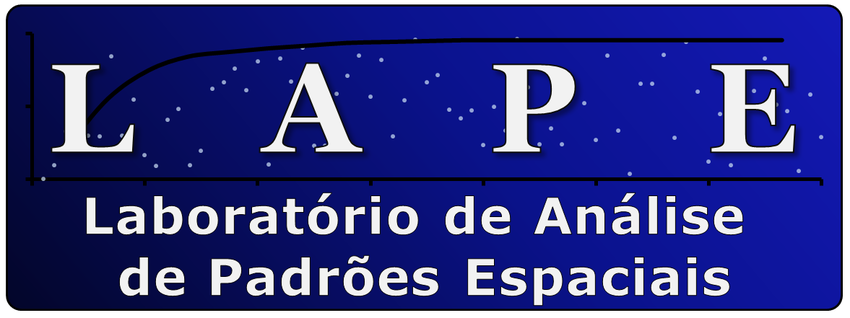

<p align="center">
  
</p>


# 🗺️ App DataVant
Aplicativo desenvolvido pelo LAPE para coleta e registro de dados em campo.


# 🖥️ Como instalar e rodar o app no computador
Esse app usa Kivy pra interface gráfica e outras libs pra gerar relatórios, lidar com imagens, etc.
Vamos configurar o ambiente passo a passo. Só precisa fazer isso UMA ÚNICA VEZ.

Depois que TUDO estiver configurado, é só. Se não instalou nada, comece pela Etapa 1

```bash 
source venv/bin/activate    # ou venv\Scripts\activate no Windows
python main.py
```


## ⚙️ Etapa 1 – Criar e ativar o ambiente virtual

### 🐧 Linux/macOS:
Abra o terminal na pasta do projeto e rode:

```bash
python3.10 -m venv venv
source venv/bin/activate
```

ou

### 🪟 Windows:
Abra o CMD ou PowerShell na pasta do projeto e rode:
```cmd
python -m venv venv
venv\Scripts\activate
```

#### 🔴 IMPORTANTE:

Você deve ver o nome do ambiente aparecendo no terminal, tipo (venv) no começo da linha do terminal.

Se der erro, confira se o Python 3.10 está instalado (python --version) e se digitou o comando certinho.

## 📦 Etapa 2 - Instalar as dependências
Com o ambiente virtual ativado, rode:
```bash
pip install -r requirements.txt
```
#### ⚠️ NÃO ESQUEÇA! Se você esquecer de ativar o venv, vai instalar tudo no sistema!
Ative antes de continuar.

## ✅ Etapa 3 - Testar se tudo foi instalado (opcional)
Você pode verificar se as bibliotecas principais foram instaladas corretamente rodando:

```bash
python -c "import kivy; print(kivy.__version__); import reportlab; print(reportlab.__version__); import PIL; print(PIL.__version__); import numpy; print(numpy.__version__)"
```
Se todas as versões aparecerem no terminal sem erro, tá pronto pra usar.

## 🚀 Etapa 4 - Rodar o app
Com tudo instalado, rode o projeto com:
```bash
python main.py
```
A interface gráfica deve abrir. Se aparecer algum erro, leia a mensagem e verifique se o venv está ativado e se tudo foi instalado corretamente.

# 📱 Como gerar um APK para Android
### ⚠️ Requisitos:
* Docker instalado e funcionando

* Não esteja com o ambiente virtual ativado (rode deactivate se necessário)

## 🧱 Etapa 1 - Preparar o ambiente com Buildozer (usando Docker)
### ⚠️ Você só precisa fazer isso UMA VEZ.
Essa etapa monta a imagem Docker com o Buildozer.

Depois disso, para compilar novas versões do app, você só precisa rodar **make android** novamente, sem reinstalar nada.

No terminal:
```bash
# Clone o repositório do Buildozer (somente necessário uma vez)
git clone https://github.com/kivy/buildozer

# 📂 Entre na pasta do Buildozer
cd buildozer

# 🔌 Se estiver em um ambiente virtual, desative (não pode usar venv aqui)
deactivate  # (se der erro, é porque já está fora do venv — sem stress)

# 🐳 Construa a imagem Docker com suporte ao Buildozer
docker build --tag=kivy/buildozer .

# 🔙 Volte para a pasta raiz do seu projeto
cd ..

# 🧹 (Opcional) Remova a pasta do Buildozer clonado — MAS CUIDADO!
# ❗ Não confundir com a pasta .buildozer (com ponto), que é do seu projeto!
rm -rf buildozer

# E por fim, ou quando for rodar novamente com o ambiente já preparado:
make android
```

## 📲 Etapa 2 – (Opcional) Rodar no emulador Android

Você pode usar o Android Studio pra testar, mas precisa de um PC com pelo menos 16 GB de RAM.

👉 [Android Studio](https://developer.android.com/studio?gad_source=1&gad_campaignid=21831783777&gbraid=0AAAAAC-IOZn6a0V8veFqa8xJSOLNQjINA&gclid=CjwKCAjw87XBBhBIEiwAxP3_A5514tYitWhbrZLE7lnqBHU4DgXAq5Vv8iWSmZlpg_kTswplxrcTHRoCasIQAvD_BwE&gclsrc=aw.ds&hl=pt-br)


## 📌 TODO (Coisas a fazer)
* Ajustar fontes e padding nos elementos da interface

* Ajustar janela de popup do salvar projeto

* Ajustar o restart do gps quando volta no App

* Cache do mapa pode crescer demais se navegar por muitas regiões (limitação nativa do Kivy)

* Adicionar funcionalidades diretamente no mapa (captura de pontos, carregar GeoJSON, etc)

* Adicionar a tela com formulários opcionais para o usuário

* Adicionar caixas de preenchimento com os pontos obrigatórios do Perfil MGB

* Adicionar possibilidade do usuário baixar o projeto em CSV e TXT
